# JD Clinic (crm) Specification

#### app version 2

JD Clinic (crm) is a Crm web application use to manage patient , staff, inventory, genrate reports , write blogs , appointment Scheduling, contact inquiry, it has 2 modules Doctor and patient
http://www.dentaltourismonline.in/ - expire

[Screen Shots](https://github.com/kratos619/personal_private_repo_description/blob/master/jdapp.md#here-are-some-screen-shots)

## Technology Use

- Laravel
- Vue js
- mysql
- custome multiauth
- Maatwebsite /
  Laravel-Excel
- axios
- sweetAlert2
- jquery
- jquery fullcalendar

## Patient - module

### Patient

- Mobile First responsive UI
- Appointment Booking , Scheduling
- Online Health Report View , Download (PDF)
- Mobile SMS Notification
- Login / Account
- Appointments Queue (Live)

## Doctor - module

### Appointments Management

- Appointment Booking , Scheduling
- Appointments Queue (Live)
- Appointments Notifications

### Patient Management

- Add Patient (CRUD)

### Report Management

- Create Report
- live Search Suggestions (like google)
- print preview (PDF Preview)
- share Documents

### Treatment Management

### Staff Management

### Personal Inventory Managment

- Complete (CRUD)
- expire date Notification

### Blogs / Articles

- write article for own wesite
- Complete (CRUD)

### Inquiry

## Here are some screen shots

### Doctor Dashboard (home)

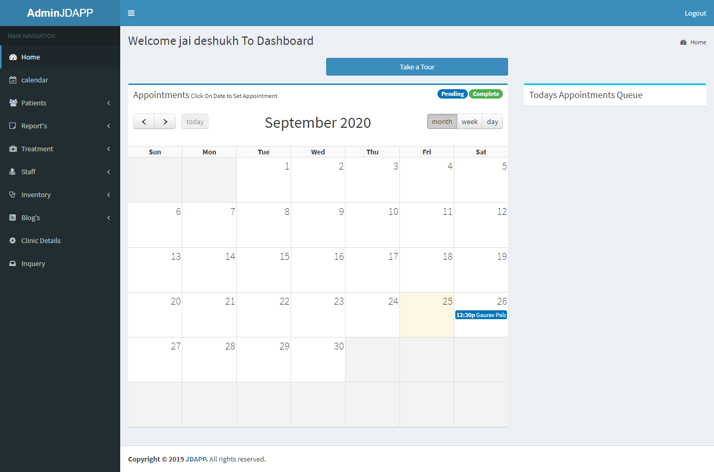

### Doctor Dashboard (Appointment)

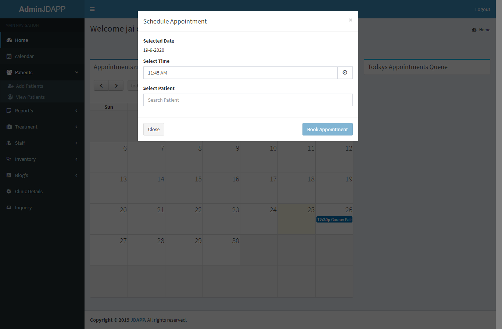

### Doctor Dashboard (Patient)

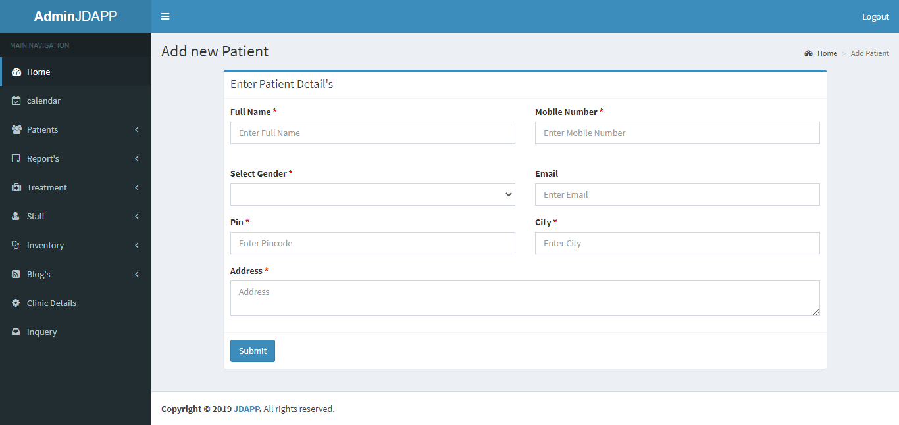

### Doctor Dashboard (Patient View)

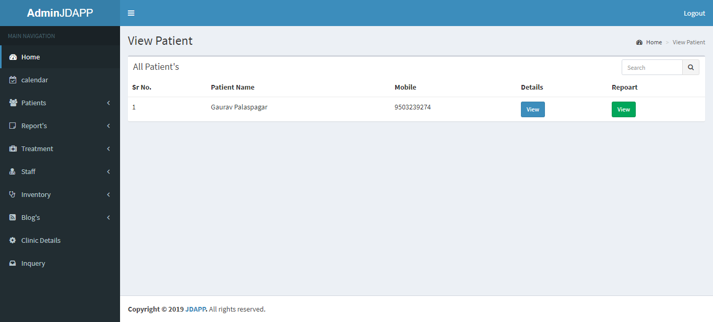

### Doctor Dashboard (Patient View)

### Doctor Dashboard (Report)

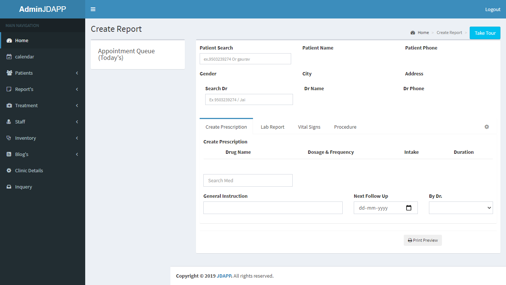

### Doctor Dashboard (Report print Preview)

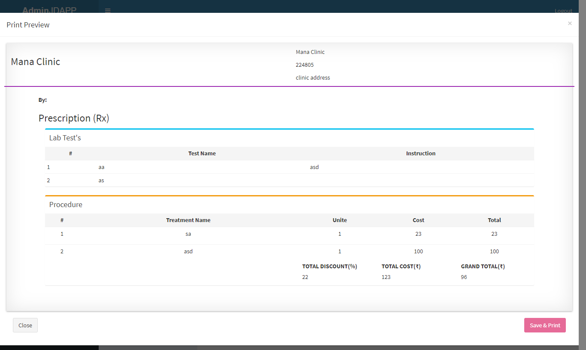

### Doctor Dashboard (Staff)

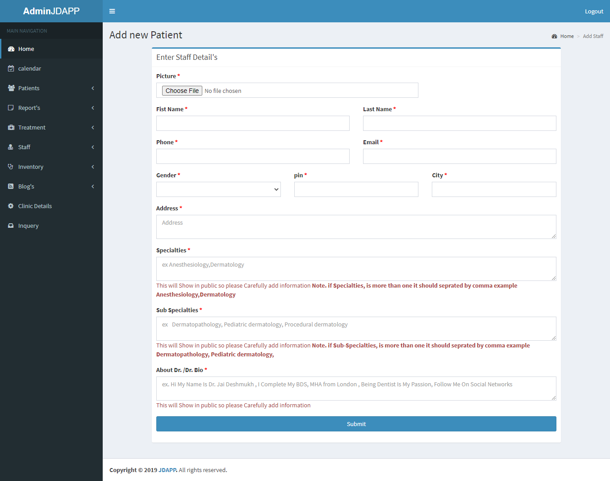

### Doctor Dashboard (Inventory)

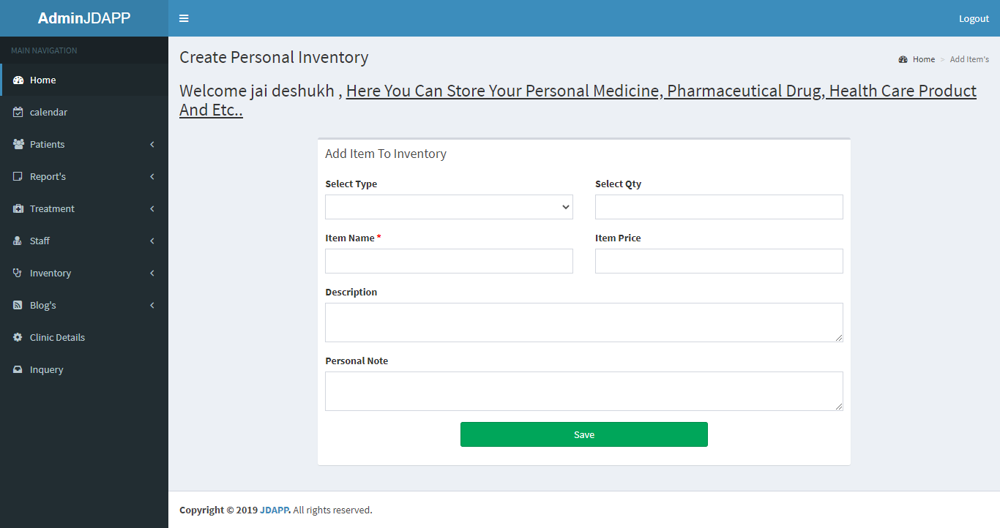

### Doctor Dashboard (Blog)

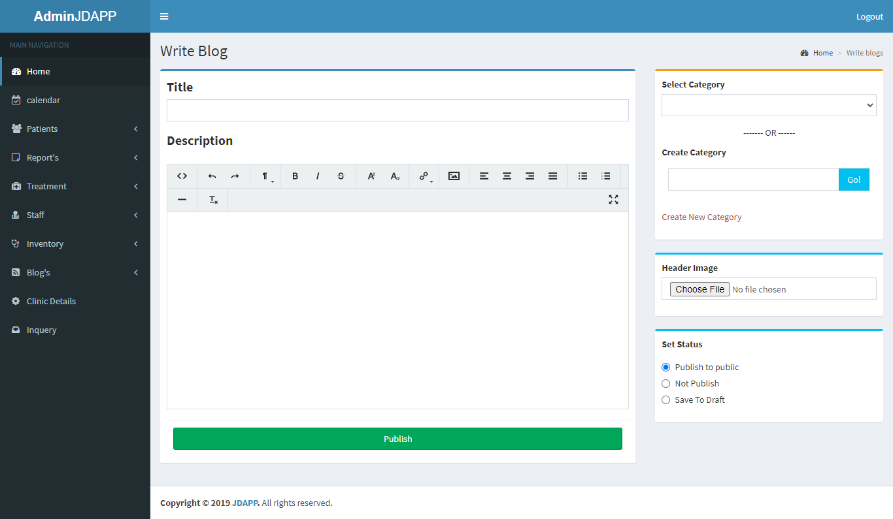

## Patient - module (ScreenShots)

### Patient Dashboard (Home)

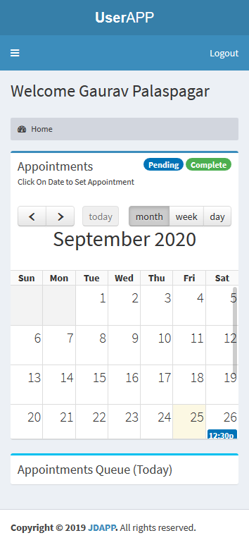

### Patient Dashboard (Report View One)

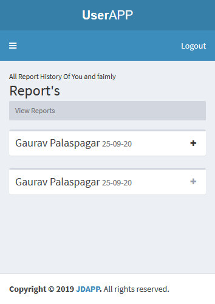

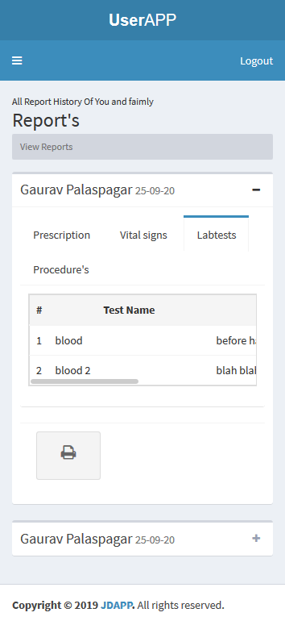

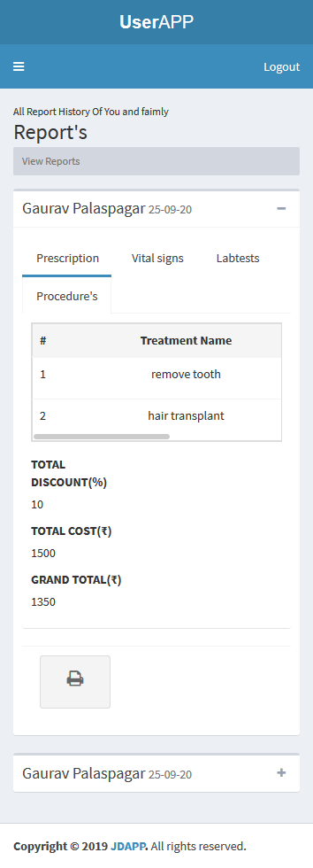
