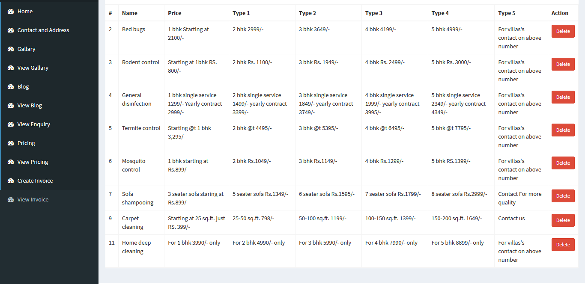

# Pestocon Services Specification

Pestocon service cms app. mainly use to generate invoices
http://www.pestoconservices.com - LIVE

[Screen Shots and Video](https://github.com/kratos619/personal_private_repo_description/blob/master/pestoconService.md#here-are-some-screen-shots)

## Technology Use

- Laravel
- Vue js
- mysql
- axios

## Admin - module

- Mobile First responsive UI
- Add pricing
- Add Gallery Images
- Generate Invoice

## Here are some screen shots

### Admin Dashboard (page invoice)

### Admin Dashboard (page invoice show)

### Admin Dashboard (pricing add)

### Admin Dashboard (pricing Show)

### Admin Dashboard (Video)

