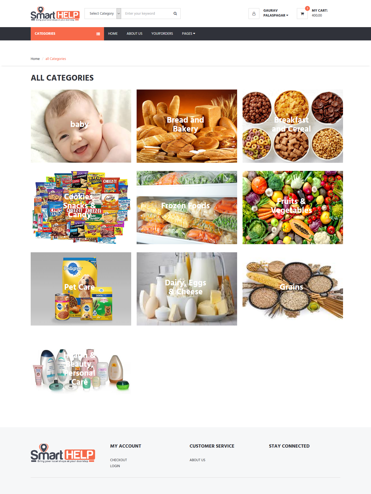
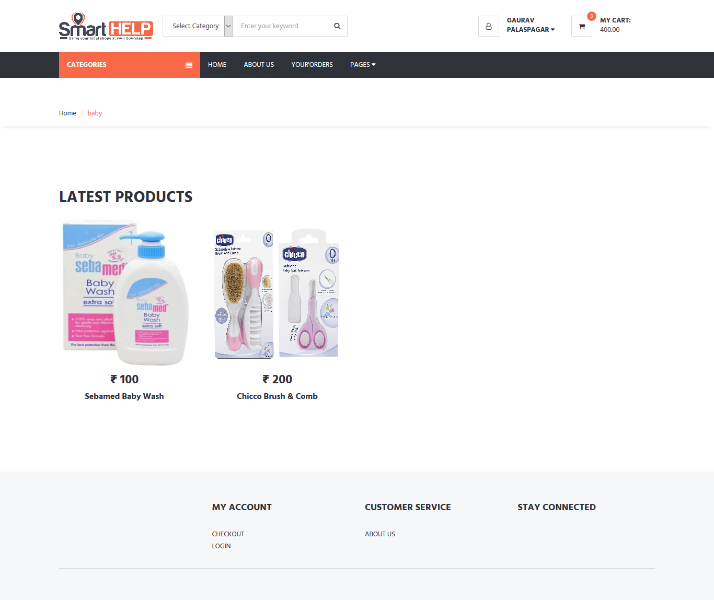
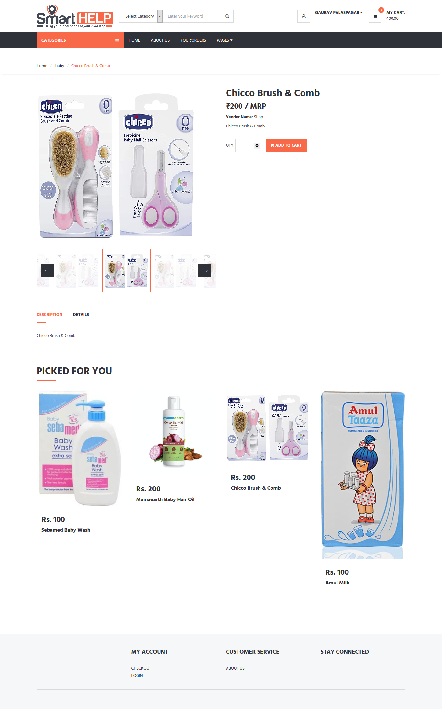
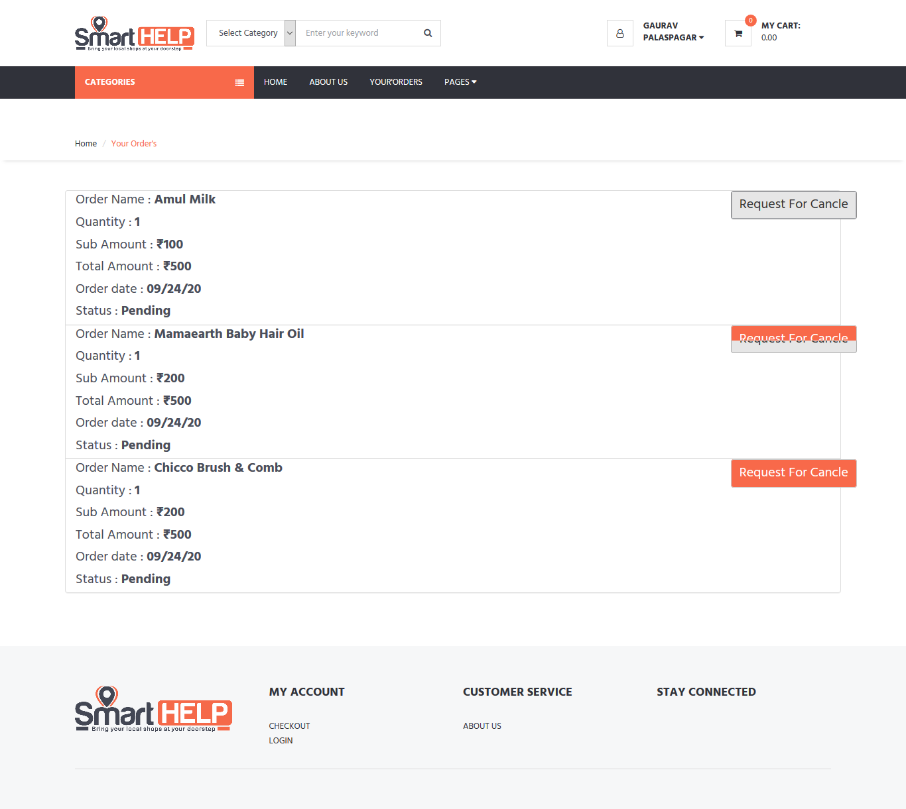
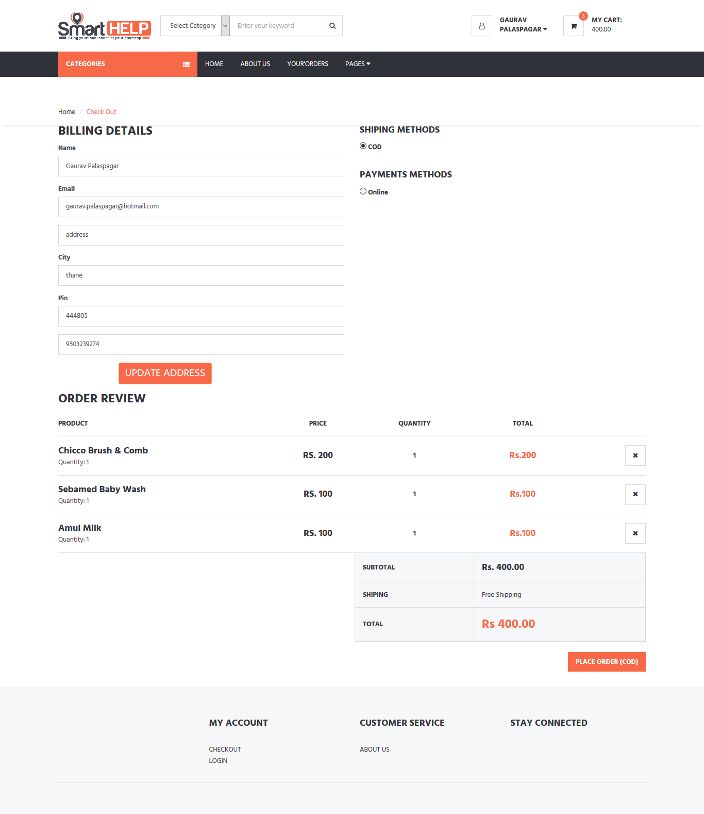

# SmartHelp Ecommerce Application Specification

Smart help is ecommerce application that contains three modules one is user (normal), Delivery Boy and other is Admin (owner) this app has its own mobile app for user and personal app for delivery Boys
http://www.smarthelp.online/ - expire

[Screen Shots](https://github.com/kratos619/personal_private_repo_description/blob/master/smarthelp.readme.md#here-are-some-screen-shots)

## Technology Use

- Laravel
- Vue js
- mysql
- custome multiauth
- Maatwebsite /
  Laravel-Excel
- axios
- sweetAlert2
- laravel/Cart
- Laravel/Passport Jsonwebtokens
- Notify Js
- Data Tables

### User

- Cart
- User Product History
- Products
- CheckOut
- Payment Option COD/ Online Payment (Instamozo)
- Cancle Order
- OTP LOGIN or Email Login

### Admin

- Main Category Management
  - Pagination, filtering, etc
- Subcategory Managment
  - Pagination, filtering, etc
- Order Managment
  - Pagination, filtering, etc
  - Cancle Order
- Delivery Boy Managment
  - Pagination, filtering, etc
  - Automatic Assign Order to Delivery Boy
  - or "admin" can assign order to Delivery Boy
  - Order Tracking Via SMS
  - send SMS notification
  - System Notification
  - User Order History
- Users managment
  - Pagination, filtering, etc
  - Send SMS notification

### Delivery Boy (Api)

    Delivery boys have there own app when user place order , order automatically randomly assign to delivery boy

- Order Manage
  - det Order Devlivery details
  - update Order Status
  - cancle Order

### Users Authentication (Api)

- Authentication will be ton using JWT/cookies
  - JWT and cookie should expire in 30 days

# Here Are Some Screen Shots

### home Screen

### All Main categories

### All Sub categories

### Single Sub Product

### Order History

### All CheckOut

